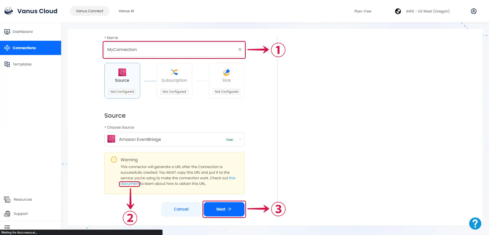
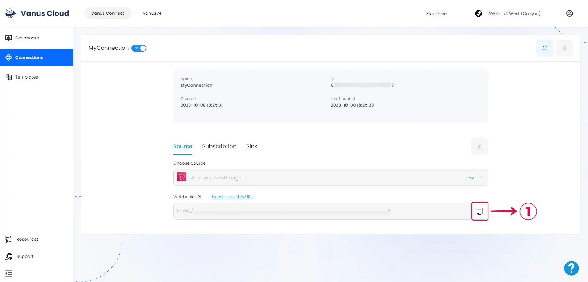
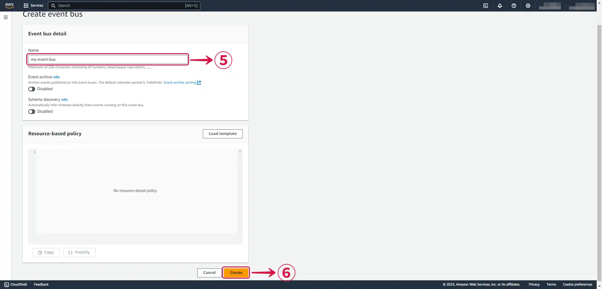
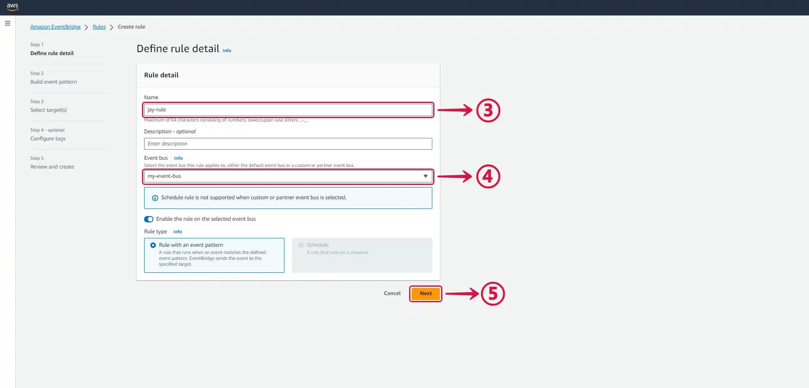
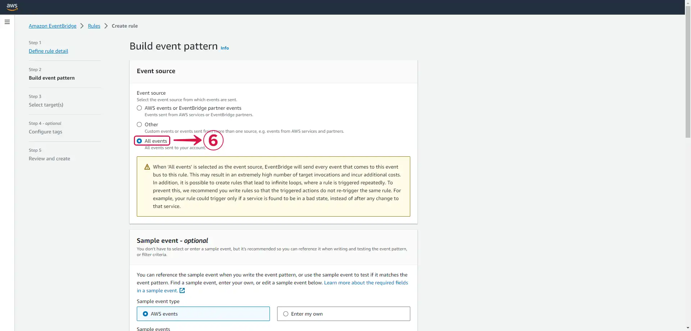
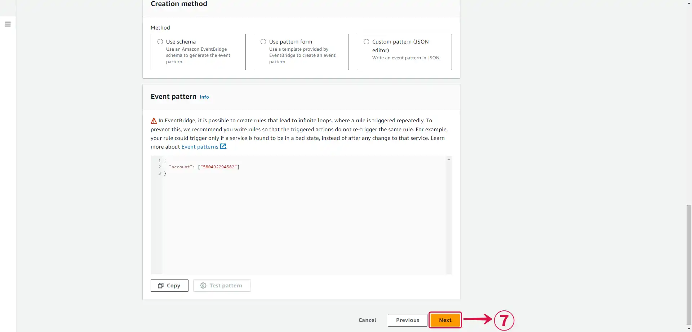
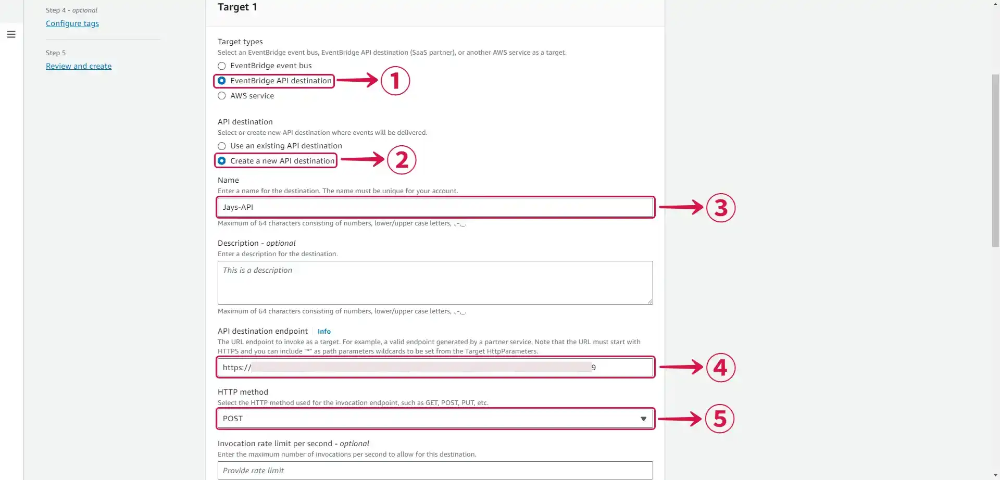
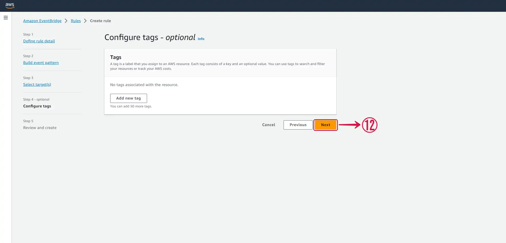

--- 
hide_table_of_contents: true
hide_title: true
---

### Prerequisites

- A [**Vanus Cloud account**](https://cloud.vanus.ai)
- An AWS Account with Administrative Privileges

---

**Perform the following steps to configure your Amazon EventBridge Source.**

### Amazon EventBridge Connection Settings

- Write a **Name**① for your connection in Vanus Connect.

- After creating the connection, there are a few more steps. Simply click the **document**② link to open a new page with all the details on how to complete the connection.

- Click **Next**③ and continue the configuration.

---

### Configuring Amazon Eventbridge

1. Click the **copy icon**① to copy the webhook url.

### Step 1: Create an Event Bus

1. Search for **Eventbridge**① and select **Amazon EventBridge**② from the results.

2. In the side menu click **Event buses**③.

3. Click on **Create event bus**④ to create a new event bus, if you haven't already.

4. Write a **Name**⑤ and press **Create**⑥.

### Step 2: Create a Rule

1. Go to **Rules**① from the side menu and click **Create rule**②.

2. **Name**③ your rule, select your **Event bus**④ and press **Next**⑤.

3. Select **all events**⑥.

4. Press **Next**⑦ to continue.

### Step 3: Create an API Destination and Connection

1. Set your API destination

- Select **EventBridge API destination**①.
- Select **Create a new API destination**② under API destination.
- Write a connection **Name**③.
- Set the **API destination endpoint**④ to the URL from Vanus Connect from **[step 1](#configuring-amazon-eventbridge)**.
- Set the **HTTP method**⑤ as `POST`.

2. Create a connection

- Select **Create a new connection**⑥.
- Write a **Connection name**⑦.
- Select **Basic (Username/Password)⑧** under Authorization type.

3. Authorization

- Create a **Username**⑨ and a **Password**⑩ of your choice, this won't be needed in this scenario but it is required.
- Press **Next**⑪.

4. Under Configure tags - optional press **Next**⑫.

5. Review and press **Create rule**⑬.

Now every event sent to your Event Bus will be sent to your Vanus connection.

---

Learn more about Vanus and Vanus Connect in our [**documentation**](https://docs.vanus.ai).
