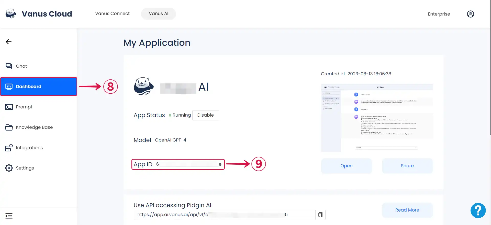

--- 
hide_table_of_contents: true
hide_title: true
---

### Prerequisites

- A [**Vanus Cloud account**](https://cloud.vanus.ai)
- Have the ability to send HTTP requests.

---

**Perform the following steps to configure your ChatAI Source.**

### ChatAI Connection Settings

1. "Write a **Name**① for your connection in Vanus Connect.


After creating the connection, proceed to click the **document link**② to open a new page with all the details on how to complete the connection.

2. Fill in the various required configurations.

- **Chat Mode③:** Select Chat Mode (ChatGPT, Ernie Bot or Vanus AI); the default is ChatGPT.

- **Context④ (optional):** Set Context to `on` if you would like for ChatGPT to remember previous messages.

- **Unique Identifier⑤ (optional):** The unique identifier differentiates among multiple conversations using the same Connection. Example identifier: conv1 identifier: conv2, etc.

- **Basic Auth Username⑥ (optional):** A method for an HTTP user agent to provide a username when making a request.

- **Basic Auth Password⑦ (optional):** A method for an HTTP user agent to provide a password when making a request.


:::Note
By choosing "Vanus AI," you can harness the power of your custom AI application within the Vanus AI platform, utilizing its extensive knowledge to enhance your chat experience.
:::

- Head to the Vanus AI's platform **Dashboard**⑧ and **copy your App ID**⑨.



- Select **Vanus AI**⑩, paste your **Vanus AI Application ID**⑪ in the provided field, fill in the remaining **configuration details⑫ (optional)**, and then proceed by clicking **Next**⑬.


### How to Use the Webhook URL to Send Message to ChatAI

- Click the **copy icon**① to copy the webhook URL.


Ask a question to ChatAI by sending a POST Request to the Webhook URL. Below I will share with you how to send a simple curl Post Request to the address.

Here is an Example of a curl Post Request of a CloudEvent.
```shell
curl \
-H "unique_identifier:value"  \
-H "Authorization: Basic base64(yourusername:yourpassword)"
-XPOST 'https://YourWebbookURL' \
-D'What is CloudEvents?'
```

---

Learn more about Vanus and Vanus Connect in our [**documentation**](https://docs.vanus.ai).
