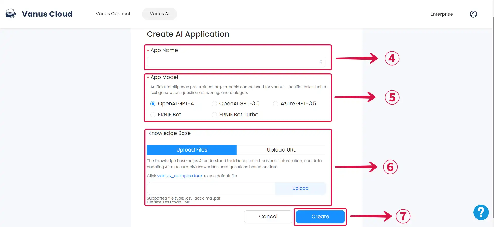
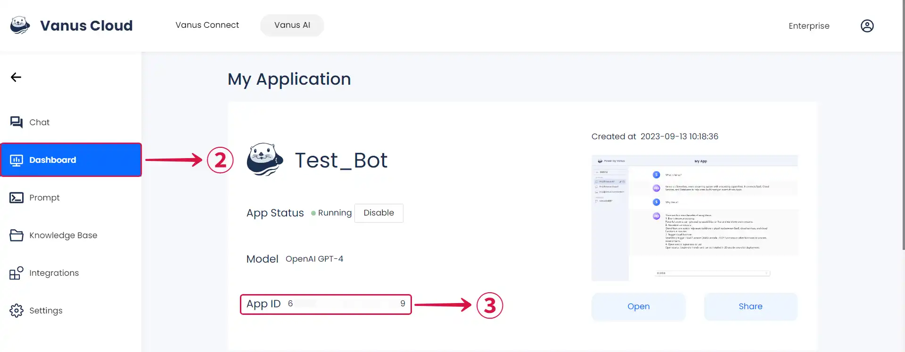

# Create an AI Application

This documentation will teach you how to create an AI Application on Vanus AI.

## Step 1: Creating Your Application

1. Navigate to [**Vanus AI**](https://ai.vanus.ai) and sign in with **Github**, **Google**, **Microsoft Account**① or click **Sign up**②.

2. Initiate a new AI App by hitting the **Create App**③ button.

3. Input an **App Name**④, select an **App Model**⑤, upload to the **Knowledge Base**⑥, then click **Create**⑦.

If you find yourself uncertain about which app model to select, please refer to the [**Large Language Models (LLM) Documentation**](https://docs.vanus.ai/vanus-ai/beginning/large-language-models/) for clear guidance on choosing the most suitable LLM for your requirements.

## Step 2: Upload Data to the Knowledge Base

The knowledge base is where you input data for your AI Application to learn from. Vanus AI allows users to use their customized data as a reference for the model.

1. Click on the **Knowledge Base**① tab to access the Knowledge Base page.

2. Click the **Add**② button if you have additional content to upload.

For comprehensive guidance on configuring your knowledge base, kindly refer to the [**Knowledge Base Documentation**](https://docs.vanus.ai/vanus-ai/beginning/knowledge-base/). Additionally, to enhance the accuracy of your results through data cleaning, explore the [**Data Cleaning Documentation**](https://docs.vanus.ai/vanus-ai/optimizing-responses/data-cleaning/).

## Step 3: Settings

On the settings page, you can tailor your AI application's behavior and appearance to your brand's specifications. This includes customizing your **App Logo**, **AI Logo**, **App Name**, and **App Greeting**.

Additionally, you can input anticipated user questions in the **Quick Question** field.

Furthermore, you have the flexibility to adjust your App Model and configure your application's response behavior, while also specifying the relevance and quantity of information retrieved by the AI application.

- To access the settings page, simply click on the **Settings**① tab.

For more detailed instructions on configuring your AI Application correctly, please refer to the [**App Settings Documentation**](https://docs.vanus.ai/vanus-ai/beginning/app-settings/).

## Step 4: Important Features

1. **Prompt:** The prompt section allows you to instruct your AI Application on its behaviour and interaction style. Depending on your specific use case, you can establish a structured approach for your app's responses, along with other customization options.

Please refer to the [**Prompt Setting Documentation**](https://docs.vanus.ai/vanus-ai/beginning/prompt-setting/) for a more comprehensive understanding of prompt configuration. Additionally, to optimize your prompts for optimal results, explore the documentation on [**Optimizing Your Prompt**](https://docs.vanus.ai/vanus-ai/optimizing-responses/optimizing-your-prompt/).

2. **Integrations:** Integrate your AI Application with our presently supported Applications.

- Click on the **Integrations**① tab, and select the Application you wish to integrate with your AI Application.

For detailed instructions on how to integrate your AI Application with specific apps, please refer to the official [**Vanus Documentation**](https://docs.vanus.ai/getting-started/what-is-vanus) page and check out the **Integrations** section of Vanus AI.

3. **Dashboard:** This is where you obtain the information required to establish a connection between your AI Application and other applications or embed it into your website.

- To access the Dashboard page, simply click on the **Dashboard**② tab. Here, you'll be able to locate your **App ID**③ along with other relevant information.

- Obtain API access for your AI Application by **copying**④ the provided link and using it according to your specific use case.

For guidance on utilizing your API endpoint, please refer to the [**API Documentation**](https://docs.vanus.ai/vanus-ai/how-to/Vanus-AI-API-en).

- Integrate your AI Application into your website using any of the **Methods**⑤ available in the dashboard.

For detailed instructions on successfully embedding your AI application in your website, please refer to the [**Website Embedding Documentation**](https://docs.vanus.ai/vanus-ai/how-to/website-embedding).
