# Google Sheets

This guide contains information to set up a Google Sheets Sink in Vanus Connect.

## Introduction

Google Sheets is a powerful spreadsheet tool that can be used to store and analyze data.

With Google Sheets Sink connector in Vanus Connect, you can easily forward real-time updates to a designated sheet in your Google Sheets account, allowing you to track events generated by your application.

## Prerequisites

Before forwarding events to Google Sheets, you must have:

- A Google account with administrative privileges.

- A [**Vanus Cloud Account**](https://cloud.vanus.ai).

## Getting Started

**To set up a Google Sheets Sink in Vanus Connect:**

### Step 1: Create a Google Spreadsheet

1. Go to [**Google Sheets**](https://docs.google.com/spreadsheets/u/0/) and **Sign in**.

2. Create a new **Blank**① spreadsheet.

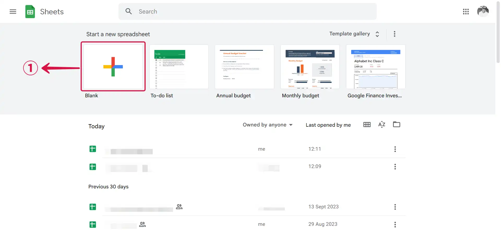

3. Copy the `ID`② of the spreadsheet found in the link.

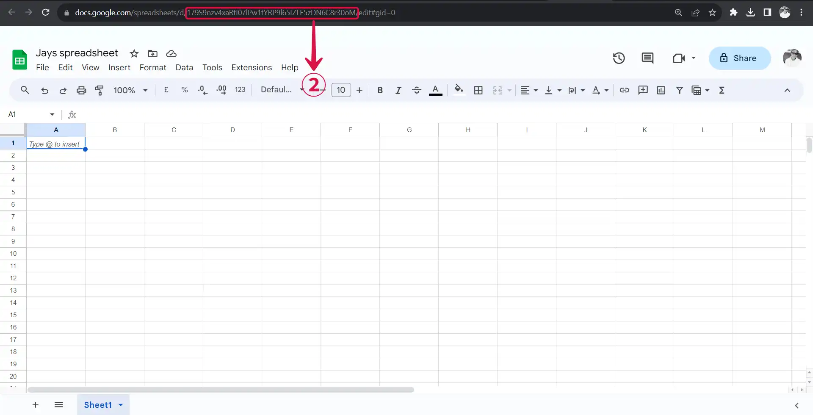

:::note
The spreadsheet's ID consists of the alphanumeric characters located between `d/` and `/edit` in the URL.
:::

---

### Step 2: Create a Connection

import Tabs from '@theme/Tabs';
import TabItem from '@theme/TabItem';

<Tabs>

<TabItem label="Authentication via Google" value="authentication-via-google">

1. Click on **Sign in with Google**① and follow the process to sign in to your Google account.


</TabItem>

<TabItem label="Service Account Credentials" value="service-account-credentials">

1. Go to the Google [**Service account**](https://console.cloud.google.com/iam-admin/serviceaccounts) and click **Create Project**①.

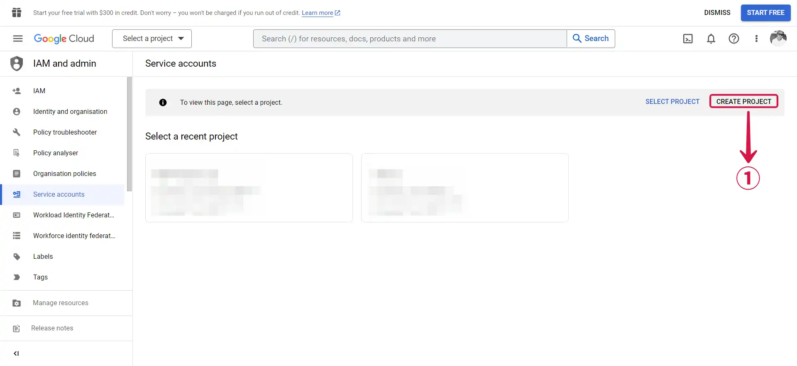

2. Write your **Project name**② and click **CREATE**③.

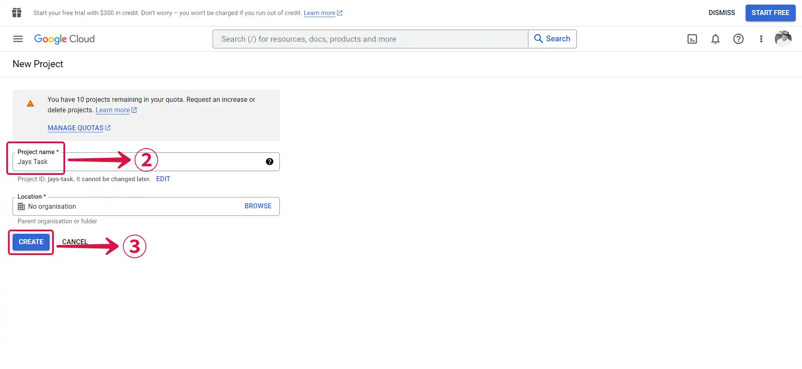

3. Now click **+ CREATE SERVICE ACCOUNT**④.

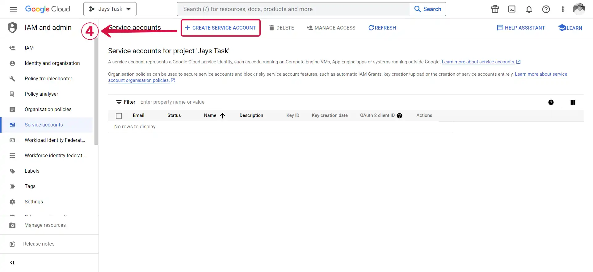

4. Create **Service account details**.

- First, write a **Service account name**⑤, this can be any name you would like to give it.

- Secondly, write a **Service account ID**⑥, this ID must be written in lowercase and needs to be at least 6 characters.

- Now click **CREATE AND CONTINUE**⑦.


5. The connection doesn't need to set specific roles you can press **DONE**⑧.

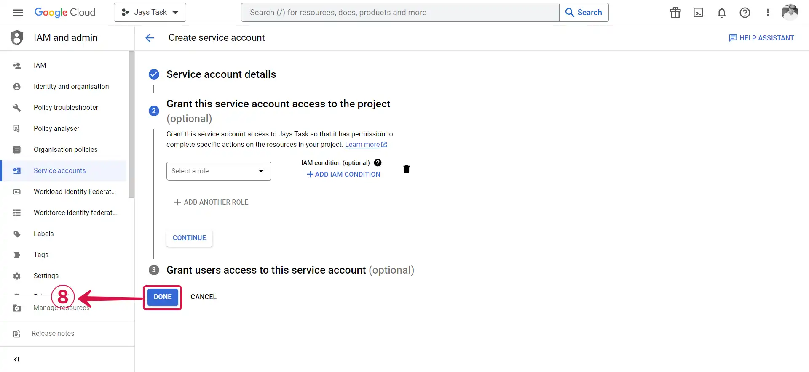

6. Now click on your **Service Account**⑨.


7. Click on **KEYS**⑩ in the TAB menu.


8. Now click on **ADD KEY**⑪ and **Create new key**⑫.

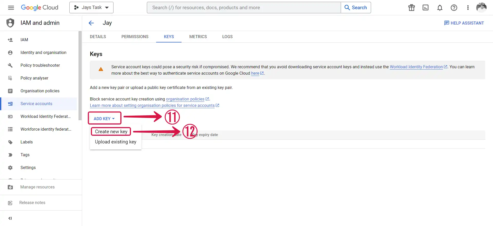

9. Choose **JSON**⑬ and **CREATE**⑭.

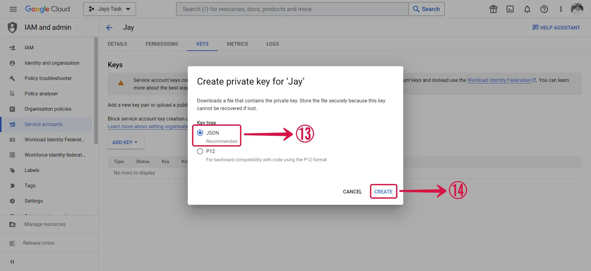

10. It will trigger the download of a JSON file copy the whole content and paste it in the **Credentials**⑮ section in Vanus Connect.

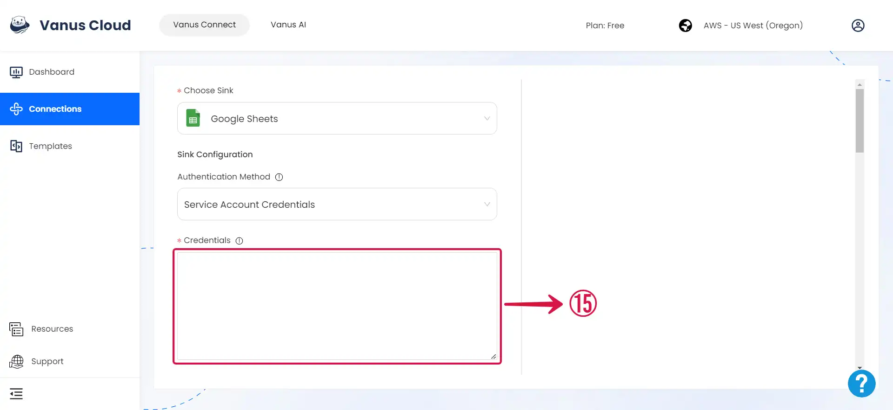

</TabItem>

</Tabs>

---

### Step 3: Google Sheets Connection Settings

1. Paste the string from the sheet URL Example: `179S9nzv4xaRtI07lPw1tYRP9l65IZLF5zDN6C8r30oM` from Step 1.

2. Obtain the name of the **Sheet**① at the bottom of the spreadsheet.

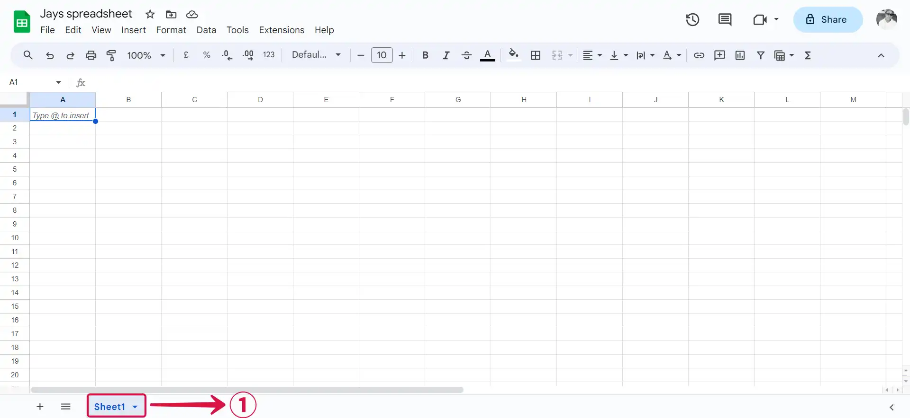

3. Paste the **Default Sheet Name**: `Sheet1`②.

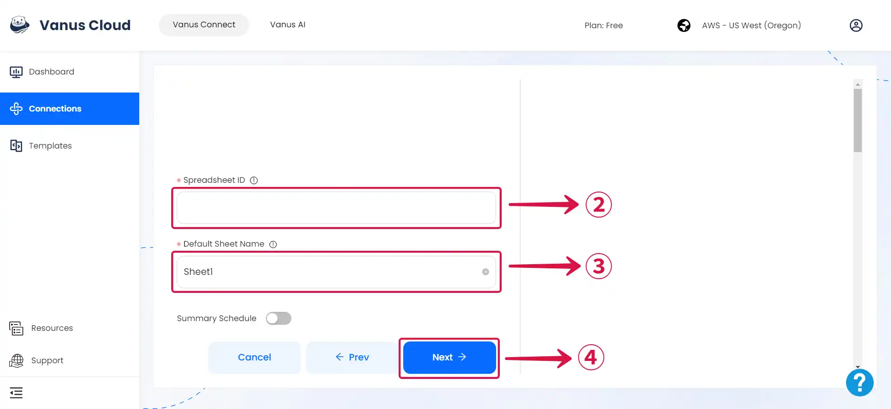

4. Click **Next**③ to continue.

---

## Required Data Format

The event data must be in JSON format with the following keys:

```json
{
    "Title": "value",
    "date": "value",
    "ect...": "value"
}
```
