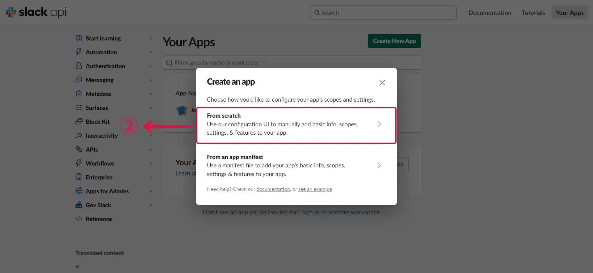
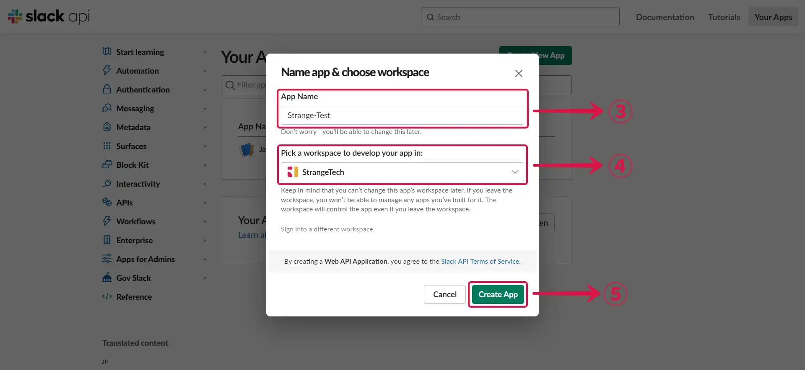
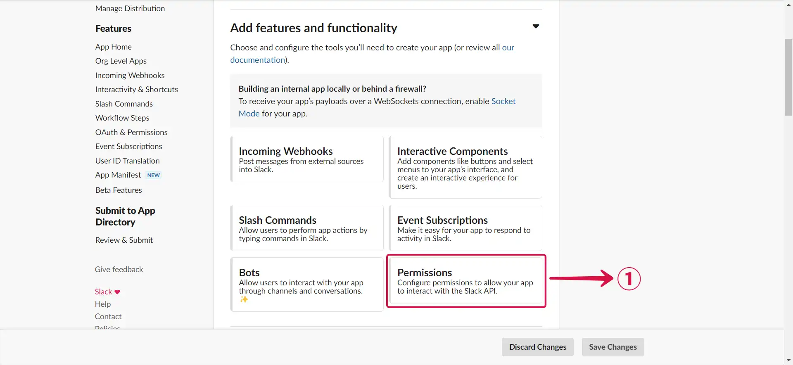

# Slack App

This guide contains information to set up a Slack Sink in Vanus Connect.

## Introduction

Slack is a cloud-based team collaboration platform that allows users to communicate, share files, and integrate with other tools and services.

With Slack Sink connector in Vanus Connect, you can easily forward real-time updates to a Slack group chat, allowing your team to stay up-to-date on all events generated by your application.

### Prerequisites

- A [**Slack Account**](https://slack.com)
- A [**Slack Workspace**](https://slack.com/help/articles/206845317-Create-a-Slack-workspace)

---

**Perform the following steps to configure your Slack Sink.**

### Step 1: Create a Slack App

1. Go to [**Slack API**](https://api.slack.com/apps), and click **Create New App**①.

2. Select **From scratch**②.

3. Set the **App name**③ and **Workspace**④, then click **Create App**⑤.

---

### Step 2: Configure your App

1. Add the **Permissions**① feature for your app.

2. Scroll down to `Scopes/Bot Token Scopes`, and click **Add an OAuth Scope**②.

3. Add `chat:write`③ and `chat:write:public`④ permission to your app.

4. Scroll up to the top of the page, and click **Install to Workspace**⑤.

5. Click **Allow**⑥ to install the app.

6. **Copy**⑦ the Bot User OAuth Token.

---

### Step 3: Slack App Connection Settings

1. Paste the **Bot User OAuth Token**① and click **Next**② to continue.

---

Learn more about Vanus and Vanus Connect in our [**documentation**](https://docs.vanus.ai).
