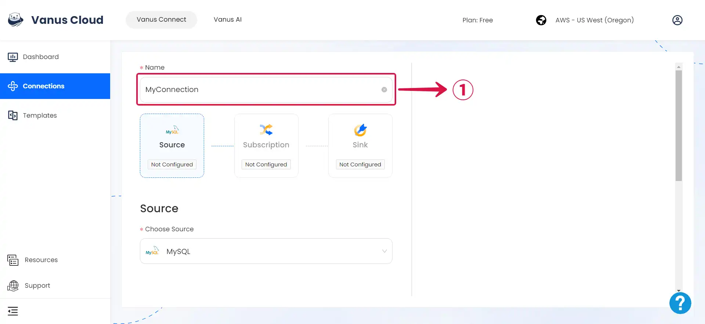

# MySQL

This guide contains information required in setting up a MySQL Source in Vanus Connect.  

## Introduction  

MySQL is a popular open-source relational database management system used to store, organize, and retrieve data for websites, applications, and other software.

Vanus Connect's MySQL Source connector simplifies the process of receiving events from a MySQL server and send it to a target.

## Prerequisites

Before forwarding events to MySQL, you must have:

- A [**Vanus Cloud Account**](https://cloud.vanus.ai)
- Have a running MySQL server.
- Have a Database and Table created.

### MySQL Connection Settings

1. Write a **Name**① for your connection in Vanus Connect.



2. Enter all the following information in Vanus Connect.


- **Host**② - The IP address of your MySQL Server.
- **Port**③ - The Port of your MySQL Server: 3306.
- **Username**④ - A Username with the following permissions RELOAD, SHOW DATABASES, REPLICATION SLAVE, REPLICATION CLIENT.
- **Password**⑤ - The user password.
- **Database**⑥ - The database name.
- **Table**⑦ - The table name.

3. Click **Next**⑧ and continue the configuration.

## Custom Connection

The event data must be in JSON format and created following the structure of your database, here's an example:

```json
{
  "title": "value",
  "date": "value",
  "ect...": "value"
}
```
